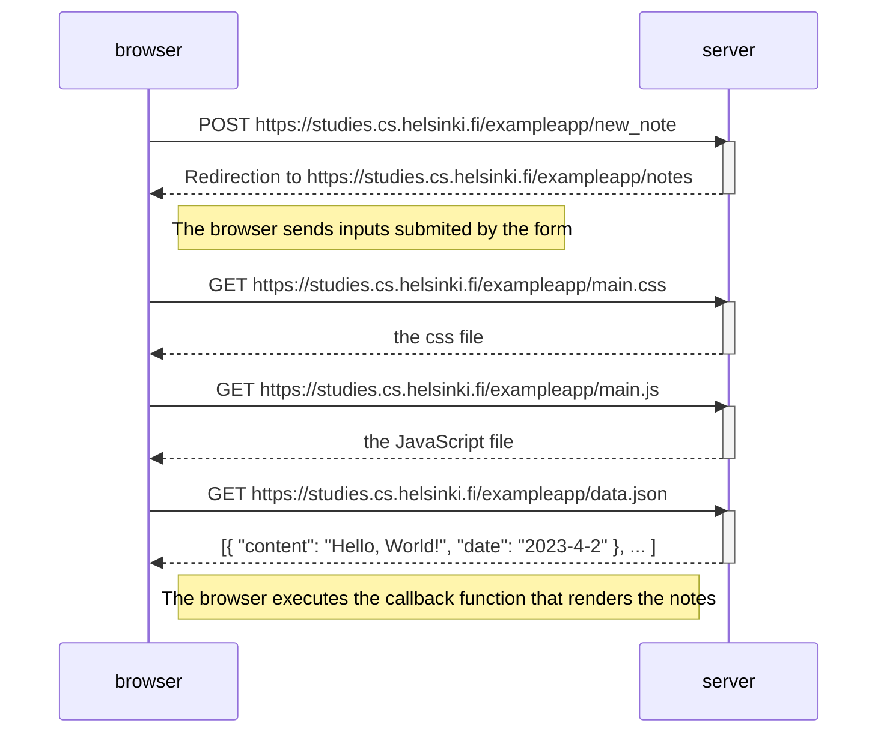

```mermaid
sequenceDiagram
    participant browser
    participant server

    browser->>server: POST https://studies.cs.helsinki.fi/exampleapp/new_note
    activate server
    server-->>browser: Redirection to https://studies.cs.helsinki.fi/exampleapp/notes
    deactivate server
    
    Note right of browser: The browser sends inputs submited by the form
    
    browser->>server: GET https://studies.cs.helsinki.fi/exampleapp/main.css
    activate server
    server-->>browser: the css file
    deactivate server

    browser->>server: GET https://studies.cs.helsinki.fi/exampleapp/main.js
    activate server
    server-->>browser: the JavaScript file
    deactivate server

    browser->>server: GET https://studies.cs.helsinki.fi/exampleapp/data.json
    activate server
    server-->>browser: [{ "content": "Hello, World!", "date": "2023-4-2" }, ... ]
    deactivate server

    Note right of browser: The browser executes the callback function that renders the notes
```
